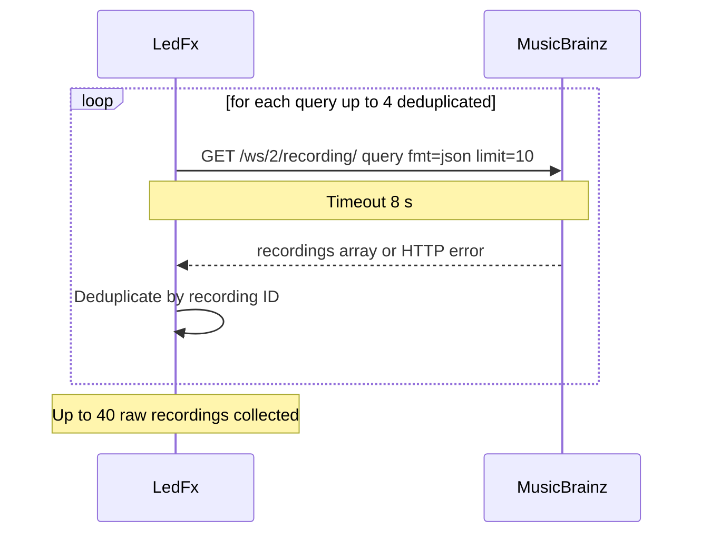
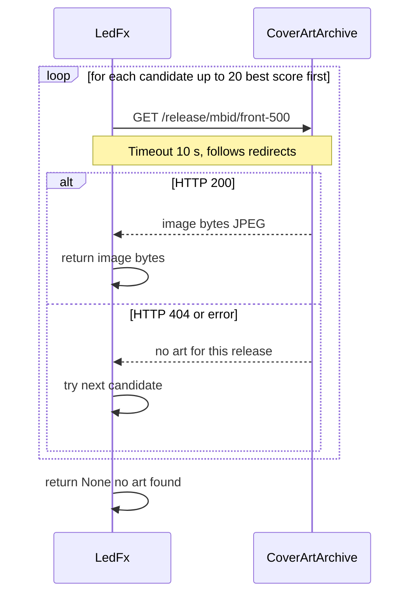

# MusicBrainz Cover Art Algorithm

Source: `ledfx/nowplaying/album_art/musicbrainz.py`  
Normalisation helpers: `ledfx/nowplaying/normalise.py`

Uses publicly available, no-auth APIs:
- **MusicBrainz recording search** — `https://musicbrainz.org/ws/2/recording/`
- **Cover Art Archive front cover** — `https://coverartarchive.org/release/{mbid}/front-500`

---

## Overview

1. **Normalise** the raw artist, title, and album from the platform provider
2. **Build queries** from strict (all three fields) down to a bare text fallback
3. **Search MusicBrainz** with each query, collecting up to 40 recordings
4. **Score** every `(recording, release)` pair and sort globally by score
5. **Fetch from Cover Art Archive** for each candidate in score order until art is found
6. Return `None` if no candidate yields art

---

## 1. Normalisation

Raw metadata from SMTC (Windows Media Transport Controls) or other platform
providers is noisy. YouTube channel names, video-title suffixes, and placeholder
album values are all stripped before any network call is made.

**Artist** — strips `" - Topic"` (auto-generated channels), `VEVO` suffix with camelCase splitting
(e.g. `MimiWebbVEVO` → `Mimi Webb`), then repeated channel suffixes (`Music`, `Official`, `Records`, etc.).

**Title** — iteratively strips bracketed noise `(Official Video)`, `[4K]`, `(2018 Remastered)`,
unbracketed `- Official Audio`, then removes a leading `Artist - ` or collaboration prefix
(e.g. `A x B - `), and finally any residual Topic/VEVO token.

**Album** — returns `None` for placeholder values (`Unknown Album`, `N/A`, empty string, etc.).

---

## 2. Query Building

Four queries are generated from strict to loose. Duplicates are removed while
preserving order.

1. `recording:"title" AND artistname:"artist" AND release:"album"`
2. `recording:"title" AND artistname:"artist"` (no album)
3. `title AND artistname:"artist"` (unquoted title)
4. `artist title` (bare text fallback)

The album query is tried first but SMTC album metadata is often absent or noisy,
so the no-album queries serve as reliable fallbacks.

---

## 3. MusicBrainz Search

---

## 4. Scoring

Every `(recording, release)` pair is scored independently so that all candidates
can be ranked globally before any Cover Art Archive request is made. Candidates
are then sorted descending by score and tried in order.

### Recording-level scoring

| Signal | Points |
|---|---|
| MusicBrainz own relevance score (0–100) | base |
| Title fuzzy similarity | × 45 |
| Title exact match | +40 |
| Artist fuzzy similarity | × 35 |
| Artist exact match | +30 |
| Is a video | −70 |
| Contains bad variant (live / remix / karaoke / demo…) | −90 |
| Neutral disambiguation (clean / explicit) | +2 |

### Release-level scoring (added on top)

| Signal | Points |
|---|---|
| Release title similarity to track title | × 20 |
| Release title exact match to track title | +30 |
| Album similarity (when album is known) | × 25 |
| Album exact match | +25 |
| Release title contains bad variant | −80 |
| Release group type: single | +22 |
| Release group type: album | +12 |
| Release group type: EP | +8 |
| Bad release type (compilation / live / remix / DJ-mix…) | −80 |
| Official status | +8 |
| Has a release date | +1 |

---

## 5. Cover Art Fetch

The 500 px thumbnail endpoint is used rather than the full-size image; full-size
images can exceed 10 MB while 500 px JPEGs are typically 50–200 KB — ample for
gradient extraction and any LED matrix resolution.

---

## Timeouts Summary

| Request | Timeout |
|---|---|
| MusicBrainz recording search | 8 s |
| Cover Art Archive image fetch | 10 s |
| Max candidates tried | 20 |
| Max recordings per query | 10 |
| Max queries issued | 4 |
