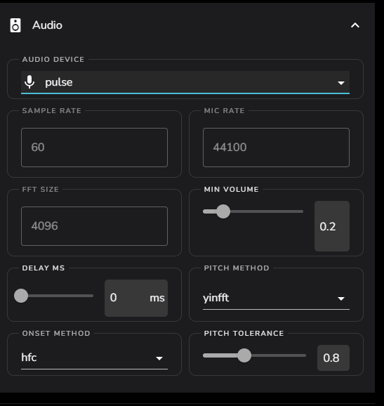

# Directing Audio

Here we explain how to pipe your system audio directly to LedFx without
having to use a microphone or any other peripheral devices.

## Linux

Tested on Ubuntu 20.10 64-bit

**Requirements**

-   [PulseAudio](https://www.freedesktop.org/wiki/Software/PulseAudio/?)
-   [PulseAudio Volume
    Control](https://freedesktop.org/software/pulseaudio/pavucontrol/)

**Instructions**

-   In the LedFx UI under \"Settings\" -\> \"Audio\", choose
    \"pulse\" as the audio device

-   In PulseAudio Volume Control under \"Recording\", choose \"ALSA
    plug-in\" and set \"Capture from\" to the audio stream you want to
    capture (e.g. \"Monitor of Built-in Audio Analog Stereo\")

## Linux CLI

Tested on Ubuntu 20.10 64-bit, Raspberry Pi OS (32 and 64-Bit)

**Requirements**

-   [PulseAudio](https://www.freedesktop.org/wiki/Software/PulseAudio/?)
-   [Pulsemixer](https://github.com/GeorgeFilipkin/pulsemixer/)

**Instructions**

-   In the LedFx UI under \"Settings\" -\> \"Audio\", choose
    \"pulse\" as the audio device

-   In **Pulsemixer** under **"F1 Output",** choose your audio application and move it to output stream you want to listen on (e.g."Built-in Audio Digital Stereo")

-   In **Pulsemixer** under **"F2 Input"**, choose "python" and move it to the audio stream you want to capture (e.g. "Monitor of Built-in Audio Digital Stereo")

## macOS

Tested on macOS Catalina 10.15.7

**Requirements**

-   [BlackHole](https://github.com/ExistentialAudio/BlackHole)

**Instructions**

-   In Audio MIDI Setup, create a [Multi Output
    Device](https://github.com/ExistentialAudio/BlackHole/wiki/Multi-Output-Device)

-   In Audio MIDI Setup, choose \"BlackHole 2ch\" and set it as
    \"Input\"

-   In the LedFx UI under \"Settings\" -\> \"Audio Input\", choose
    \"BlackHole 2ch\" as the current device

**Alternatives**

-   [Loopback](https://rogueamoeba.com/loopback/): Can direct the audio
    output of individual applications but requires expensive license to
    run more than 20 minutes.

## Windows

Tested on Windows 10 (21H2)

Windows have output devices and input devices. LedFx works processing an
input device.

**Stereo Mix (analog output)**

-   Follow the instructions described in the link to ensure the \"Stereo
    Mix\" Device is available: <https://thegeekpage.com/stereo-mix/>
-   The result should be something like:

-   Once the device is set as \"Default Device\" (right-click, Set as
    Default Device), all generated analog sound from the PC should be
    \"mixed\" into this input device and LedFx should work
    appropriately.
-   *If your current setup uses a digital output (e.g.: HDMI), \"Stereo
    Mix\" won\'t capture sound and an external tool needs to be used.*
    An example configuration is described below.

**External Tool (digital output)**

-   Using digital outputs, an external tool such as
    <https://vb-audio.com/Voicemeeter/banana.htm> is needed. Other
    \"virtual devices/cables\" applications should work similarly.
-   Once the tool is installed, set the tool\'s playback device as
    default:

-   Set the matching \"Recording\" device as default:

-   And if you want to still listen to the audio on the digital output,
    you can use the set the \"Listen\" device on the \"Recording\" input
    (right-click -\> properties):

## Webaudio

:::: warning
::: title
Warning
:::

This feature is still in alpha.
::::

**Enabling**

-   First you must have Alpha Mode enabled, see [How To: Enable Alpha Mode](/howto/alpha.md)
-   Open the alpha settings under client features and enable webaudio
    setting.

**Usage**

-   When your main LedFx instance (the one that is connected to all
    lights) is running, open another instance on another device (make
    sure webaudio is enabled on new instance).
-   In settings, under core settings, expand audio and you should see an
    icon that looks like this:

-   Click on that icon and a small window should appear where you can
    enter the name for your device. Enter the name and click on the
    check mark.
-   In your browser you should get a pop-up which asks you to give
    permission to the site to use your microphone/other audio input,
    confirm it.
-   Refresh the webpage of the main LedFx instance and in the audio
    settings select your newly created device. Now your lights should be
    visualized from the audio of the other device.

:::: note
::: title
Note
:::

If audio is not being sent or you were not able to allow microphone
permission, it may be due to running LedFx without HTTPS. In this case
the solution is either to run LedFx as HTTPS or to allow media devices
in your browser to be accessed without HTTPS. To fix this:

-   Firefox:
    <https://stackoverflow.com/questions/60957829/navigator-mediadevices-is-undefined/66605018#66605018>
-   Chrome:
    <https://sites.google.com/a/chromium.org/dev/Home/chromium-security/deprecating-powerful-features-on-insecure-origins>
    (specifically \"Testing Powerful Features\" section)
::::

**Type Setting**

When creating a new webaudio device, you may see, below the name
entering field, an ability to choose between ws-v1 and ws-v2. Unless
something does not work, you should always use ws-v2. The reason for
that is ws-v2 using significantly less bandwidth. The ws-v1 setting
sends audio data (which is float type) as plain text, meaning that for
each number a byte is sent (can be up to 6 bytes per number), even
though the audio data being sampled is only 16-bit. The ws-v2 setting
instead sends the audio data as base64, which is a binary data encoding
method, greatly reducing the used bandwidth.
