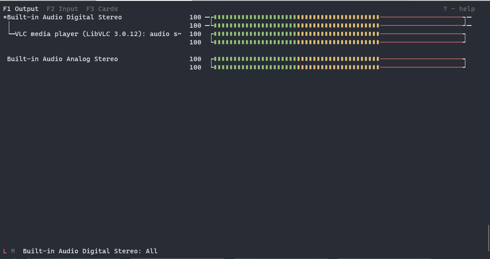
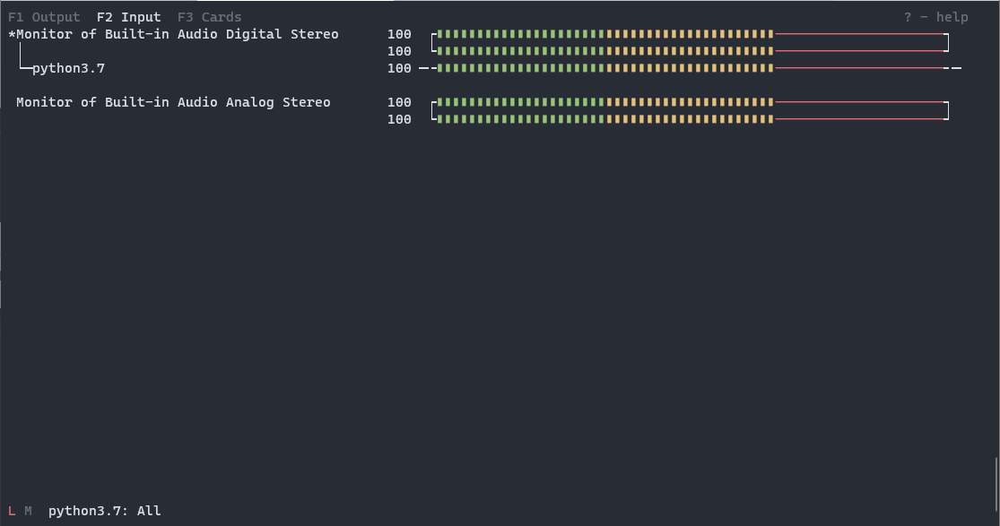
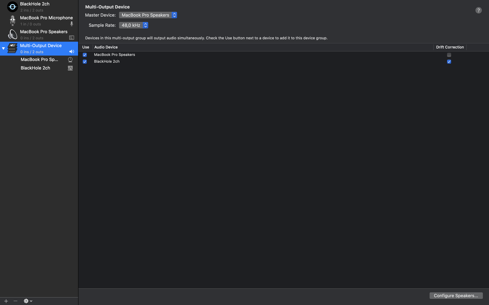

===============
Directing Audio
===============

Here we explain how to pipe your system audio directly to LedFx without
having to use a microphone or any other peripheral devices.

Linux
======

Tested on Ubuntu 20.10 64-bit

.. rubric:: Requirements

-  `PulseAudio <https://www.freedesktop.org/wiki/Software/PulseAudio/?>`__
-  `PulseAudio Volume
   Control <https://freedesktop.org/software/pulseaudio/pavucontrol/>`__

.. rubric:: Instructions

-  In the LedFx UI under "Settings" -> "Audio Input", choose "pulse" as
   the current device

.. image:: ./_static/direct_audio_linux_1.png
   :align: center
   :width: 100%

-  In PulseAudio Volume Control under "Recording", choose "ALSA plug-in"
   and set "Capture from" to the audio stream you want to capture (e.g.
   "Monitor of Built-in Audio Analog Stereo")

.. image:: ./_static/direct_audio_linux_2.png
   :align: center
   :width: 100%
   
Linux CLI
=========

.. note::
  Python will not show in Pulsemixer until pulse is set like Audio Input in LedFx UI and some reactive effect is set and send to device.

Tested on Ubuntu 20.10 64-bit, Raspberry Pi OS (32 and 64-Bit)

.. rubric:: Requirements

-  `PulseAudio <https://www.freedesktop.org/wiki/Software/PulseAudio/>`__
-  `Pulsemixer <https://github.com/GeorgeFilipkin/pulsemixer/>`__

.. rubric:: Instructions

-  In the LedFx UI under "Settings" -> "Audio Input", choose "pulse" as
   the current device

.. image:: ./_static/direct_audio_linux_1.png
   :align: center
   :width: 100%

-  In Pulsemixer under "F1 Output", choose your audio application
   and move it to output stream you want to listen on (e.g.
   "Built-in Audio Digital Stereo")

   
-  In Pulsemixer under "F2 Input", choose "python"
   and move it to the audio stream you want to capture (e.g.
   "Monitor of Built-in Audio Digital Stereo")

macOS
======

Tested on macOS Catalina 10.15.7

.. rubric:: Requirements

-  `BlackHole <https://github.com/ExistentialAudio/BlackHole>`__

.. rubric:: Instructions

-  In Audio MIDI Setup, create a `Multi Output
   Device <https://github.com/ExistentialAudio/BlackHole/wiki/Multi-Output-Device>`__

-  In Audio MIDI Setup, choose "BlackHole 2ch" and set it as "Input"

.. image:: ./_static/directing_audio_macos_2.png
   :align: center
   :width: 100%

-  In the LedFx UI under "Settings" -> "Audio Input", choose "BlackHole
   2ch" as the current device

.. image:: ./_static/directing_audio_macos_3.png
   :align: center
   :width: 100%

.. rubric:: Alternatives

-  `Loopback <https://rogueamoeba.com/loopback/>`__: Can direct the
   audio output of individual applications but requires expensive
   license to run more than 20 minutes.

.. |LedFx UI| image:: ./_static/direct_audio_linux_1.png
.. |PulseAudio Volume Control| image:: ./_static/direct_audio_linux_2.png

.. |Multi Output Device 2| image:: ./_static/directing_audio_macos_2.png
.. |Multi Output Device 3| image:: ./_static/directing_audio_macos_3.png
