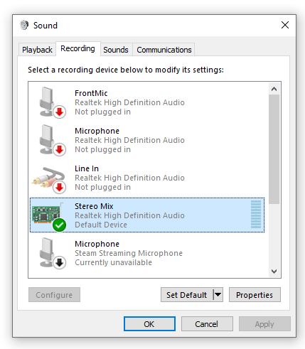
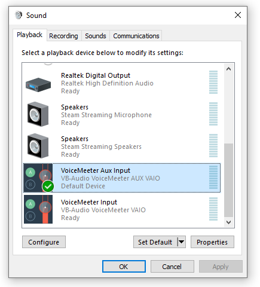
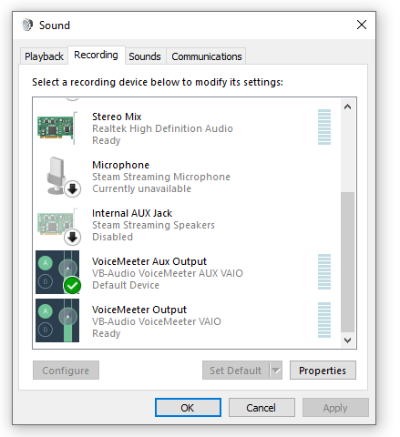
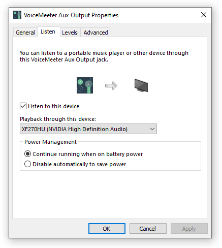

===============
Directing Audio
===============

Here we explain how to pipe your system audio directly to LedFx without
having to use a microphone or any other peripheral devices.

Linux
======

Tested on Ubuntu 20.10 64-bit

.. rubric:: Requirements

-  `PulseAudio <https://www.freedesktop.org/wiki/Software/PulseAudio/?>`__
-  `PulseAudio Volume
   Control <https://freedesktop.org/software/pulseaudio/pavucontrol/>`__

.. rubric:: Instructions

-  In the LedFx UI under "Settings" -> "Audio Input", choose "pulse" as
   the current device

.. image:: ./_static/direct_audio_linux_1.png
   :align: center
   :width: 100%

-  In PulseAudio Volume Control under "Recording", choose "ALSA plug-in"
   and set "Capture from" to the audio stream you want to capture (e.g.
   "Monitor of Built-in Audio Analog Stereo")

.. image:: ./_static/direct_audio_linux_2.png
   :align: center
   :width: 100%

macOS
======

Tested on macOS Catalina 10.15.7

.. rubric:: Requirements

-  `BlackHole <https://github.com/ExistentialAudio/BlackHole>`__

.. rubric:: Instructions

-  In Audio MIDI Setup, create a `Multi Output
   Device <https://github.com/ExistentialAudio/BlackHole/wiki/Multi-Output-Device>`__

.. image:: ./_static/directing_audio_macos_1.png
   :align: center
   :width: 100%

-  In Audio MIDI Setup, choose "BlackHole 2ch" and set it as "Input"

.. image:: ./_static/directing_audio_macos_2.png
   :align: center
   :width: 100%

-  In the LedFx UI under "Settings" -> "Audio Input", choose "BlackHole
   2ch" as the current device

.. image:: ./_static/directing_audio_macos_3.png
   :align: center
   :width: 100%

.. rubric:: Alternatives

-  `Loopback <https://rogueamoeba.com/loopback/>`__: Can direct the
   audio output of individual applications but requires expensive
   license to run more than 20 minutes.

.. |LedFx UI| image:: ./_static/direct_audio_linux_1.png
.. |PulseAudio Volume Control| image:: ./_static/direct_audio_linux_2.png
.. |Multi Output Device 1| image:: ./_static/directing_audio_macos_1.png
.. |Multi Output Device 2| image:: ./_static/directing_audio_macos_2.png
.. |Multi Output Device 3| image:: ./_static/directing_audio_macos_3.png

Windows
=======
Tested on Windows 10 (21H2)

Windows have output devices and input devices. LedFx works processing an input device.

.. rubric:: Stereo Mix (analog output)

-  Follow the instructions described in the link to ensure the "Stereo Mix" Device is available: https://thegeekpage.com/stereo-mix/

- The result should be something like:

- Once the device is set as "Default Device" (right-click, Set as Default Device), all generated analog sound from the PC should be "mixed" into this input device and LedFx should work appropriately.

- *If your current setup uses a digital output (e.g.: HDMI), "Stereo Mix" won't capture sound and an external tool needs to be used.* An example configuration is described below.

.. rubric:: External Tool (digital output)

- Using digital outputs, an external tool such as https://vb-audio.com/Voicemeeter/banana.htm is needed. Other "virtual devices/cables" applications should work similarly.

- Once the tool is installed, set the tool's playback device as default:

- Set the matching "Recording" device as default:

- And if you want to still listen to the audio on the digital output, you can use the set the "Listen" device on the "Recording" input (right-click -> properties):

