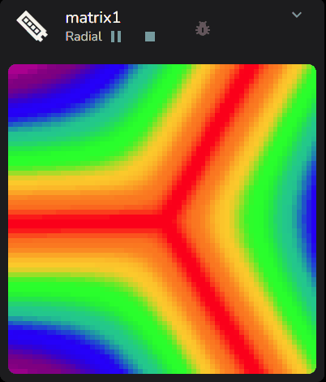
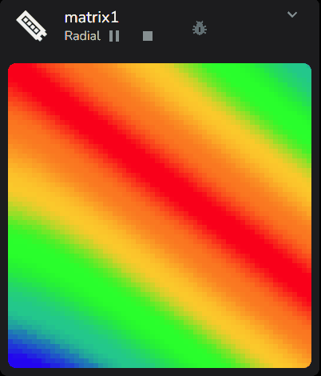

# Radial

This is a simple example of the Radial effect using strobe and later, power effects as inputs.

<video width="426" height="720" controls loop>
   <source src="../../_static/effects/matrix/radial/radial1.mp4" type="video/mp4">
   Your browser does not support the video tag.
</video>
<br><br>

## Overview

Radial is an effect that allows you to map the rendered output of an existing source virtual running another effect into the render space of the current virtual.

It is intended that the target virtual for the Radial effect is a matrix.

The source virtual's pixel data is rendered into the target virtual with a sweep-like mapping.

This can lead to exotic and sometimes quite unexpected and impactful matrix effects.

The following demonstrations are based on using a dummy 1d strip of 128 pixels as the source and a 64 x 64 dummy matrix as the target.

```{Note}
See [Dummy Vumeter How-To](/howto/dummy_vumeter.md) for a 1d strip as the source. We will name our example strip1.

See [Dummy Matrix How-To](/howto/dummy_matrix.md) for a 2d matrix as the target. We will name our example matrix1.
```

All sources are stretched to fit, so beyond performance, there is no need to match source virtual to the target.

As matrix1 consists of 64x64 = 4096 pixels, all visualisation examples are with settings / Pixel Graphs / Frontend Pixels set to 4096.

## Settings

There are several controls for the Radial effect, but once understood, their application is straightforward.


It is important to understand the basic principle of the Radial Effect.

Via the setting of **SOURCE VIRTUAL** the current 1d pixel frame from that source virtual is rendered into the matrix space and then rotated about the center in a sweep to fill the matrix.

In the default configuration this should produce a well formed circular effect.

### Source Virtual example

A 1d strip static effect, in this case **gradient**, is being used to keep images consistent in the following examples.

An audio reactive effect for the **SOURCE VIRTUAL** is where things really come alive!


### Mapping into the Radial Effect

Left maps to the matrix center, and right to the outside edge. Then the strip is swept through a full 360 degrees.


This gives a clean circular pattern that will update live as the Source Virtual renders its own effect.


**ROTATE** and **BRIGHTNESS** are standard matrix controls for 90 degree step rotation and overall effect brightness, and not specific to Radial.

### Edges

**EDGES** at the default 0 implies a circular mapping.

Moving **EDGES** to 1 will trigger a linear mapping from the center out, leading to a mirrored vertical pattern.


**EDGES** set to 2 will trigger an oval.


**EDGES** set to 3 gives us the first true polygon effect


Things become more predictable as **EDGES** moves from 3 all the way up to 8


### Polygon Switch

The **POLYGON** switch allows the inversion of the edge mapping for values 3 and above. It has no effect for values of 0 to 2.

Using the example of a 3 edge triangle, turning the **POLYGON** switch to False we get


Here is 5 edge, to set us up for the **STAR** slider example


### Star Slider

The **STAR** slider allows the polygon edges to be pushed or pulled around the center point. Note it has no effect if the **POLYGON** switch is False.

First lets turn **POLYGON** back to True so we get a well formed pentagon.


Move the **STAR** slider to -0.11, as negative values give sharper points, and we achieve a well formed pentangle.


Moving the slider further we can deform the polygon to the extreme, in this case -0.69


Positive **STAR** values give a more organic effect, in this example at 0.28


### Rotation

The **ROTATION** slider allows the effect to be smoothly rotated to any position if the **SPIN** slider is set to zero, so it is otherwise static. So triangles for example can be precisely pointed down.


### Twist

**TWIST** is used to impose a spiral transform onto the effect.

Partial values such as 0.5 will apply the spiral, but start and end will not match, generating an artifact.

In these examples we will twist with **EDGES** set to 0 for a circular effect.


Whole numbers will give a well formed spiral effect with the number of spokes matching the value, so in this example **TWIST** is set to 3


### Spin

The **SPIN** slider can be used to spin the effect in a clockwise or anti-clockwise direction, using the selected **FREQUENCY RANGE** as the audio impulse and the **SPIN** slider magnitude to influence the level of impulse injected into the spin filter.

<picture>
   <source srcset="../../_static/effects/matrix/radial/radial19.gif" type="image/webp">
   
</picture>
<br><br>

### X and Y offset

Finally the **X OFFSET** and **Y OFFSET** sliders can be used to place the center of the effect anywhere in the matrix. In this case, we will push the center into the top left corner and have the 3 pointed inverted polygon sweeping past.

<picture>
   <source srcset="../../_static/effects/matrix/radial/radial20.gif" type="image/webp">
   
</picture>
<br><br>

Now go back to the video at the top of this page and combined with audio reactive effects you can understand how these are achieved.

There are **MANY** more surprising things that can be achieved, take some time and explore!