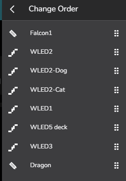

# How to: Reorder Device and Virtuals

It is now possible to set the order of devices and viruals in the device
tab to make navigating your devices easier, with a simple drag and drop
operation.

## Enable Sort Devices by user

First the feature needs to be enabled to override other sort options

This is found under Settings / Devices / Sort Devices by User

## Open the Change Order drag and drop bar

Once this has been enabled, when in the devices view, we will have a new
option under the 3 dot menu in the top right

Selecting Change Order will bump in a drag and drop bar with all devices
and virtuals

## The Drag and Drop bar

All devices and viruals will be in the current display order, an example
is below.

We can see in this example that our many devives are in a poor random
order

## Reordering to preference

So lets start sorting that out

<picture>
   <source srcset="../_static/howto/reorder/reorder.gif" type="image/webp">
   
</picture>
  

## All is well with the world

Thats better\...

<picture>
   <source srcset="../_static/howto/reorder/better.gif" type="image/webp">
   
</picture>
  
