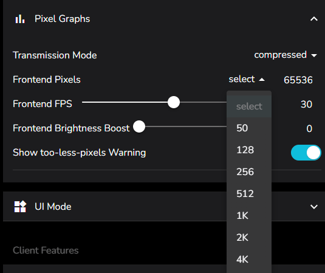

# Tips and Tricks

A random collection of tips and tricks on various interesting or ill-advised things!

Know something not captured here, that could help your fellow LedFx users lost in the wildeness of complexity? Then please raise a PR, building the docs is easy in vscode! See [Document Development](../README.md)

## Settings / Pixel Graphs / Frontend Pixels

This parameter limits the number of pixels being sent to the front end for visualisations, keeping local and remote socket traffic down and limiting overheads in the system.

The default value is 81, which comes from LedFx original intent to be driving 1d LED strips. If you run matrix then bump it up! LedFx will send the number of pixels present in the device up to this maximum value and will then downscale content to fit.

If you are running large matrix then setting to 4096 is advised as a limit. This will directly support 64 x 64 pixel matrix at full resolution.

For any matrix larger that 4096 pixels ( or any value that Frontend pixels is set to ) LedFx will downscale the visualisation data to control bandwidth and processing overheads for the frontend.

HOWEVER: Ledfx supports 16384, and even upto the max of 65536 setting for extreme browser visualisation needs.

Don't do this unless you REALLY need that higher resolution in the browser, such as setting locally hosted monitors to the fullscreen visualisation ( via double click ) of a dummy device matrix. For example, a dummy device set to 339 x 191 pixels.

Why can't I go to full 1080p? Well that's ~2 million pixels. To shovel that around takes a GPU and is not really suitable for the original intent of LedFx, which is pushing pixels in python. There are full PC visualisers out there, go find one!