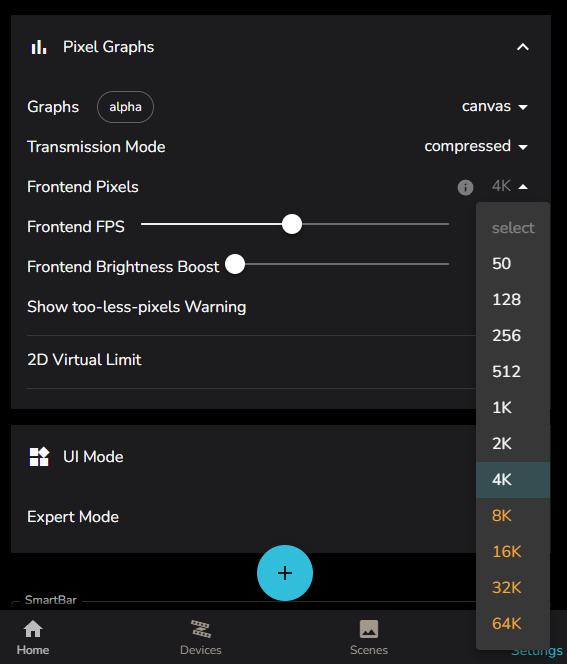

# Tips and Tricks

A random collection of tips and tricks on various interesting or ill-advised things!

Know something not captured here, that could help your fellow LedFx users lost in the wildeness of complexity? Then please raise a PR, building the docs is easy in vscode! See [Document Development](../README.md)

Further reading
- [Misc Troubleshooting](../troubleshoot/trouble.md)
- [Network and Performance Troubleshooting](../troubleshoot/network.md)

## Settings / Pixel Graphs / Frontend Pixels

This parameter limits the number of pixels being sent to the front end for visualisations, keeping local and remote socket traffic down and limiting overheads in the system.

The default value is 81, which comes from LedFx original intent to be driving 1d LED strips. If you run matrix then bump it up! LedFx will send the number of pixels present in the device up to this maximum value and will then downscale content to fit.

If you are running large matrix then setting to 4096 is advised as a limit. This will directly support 64 x 64 pixel matrix at full resolution.

For any matrix larger that 4096 pixels ( or any value that Frontend pixels is set to ) LedFx will downscale the visualisation data to control bandwidth and processing overheads for the frontend.

HOWEVER: Ledfx supports 16384 ( 16K ), and even upto the max of 65536 ( 65K ) setting for extreme browser visualisation needs. See Orange options in dropdown.

Don't do this unless you REALLY need that higher resolution in the browser, such as setting locally hosted monitors to the fullscreen visualisation ( via double click ) of a dummy device matrix. For example, a dummy device set to 339 x 191 pixels.

Why can't I go to full 1080p? Well that's ~2 million pixels. To shovel that around takes a GPU and is not really suitable for the original intent of LedFx, which is pushing pixels in python. There are full PC visualisers out there, go find one!

These large front end visualisation payloads imply a heavy loading on the network infrastructure. This can directly impact the physical performance of the LED endpoints themselves, effectively challanging that critical communication for bandwidth on the network.

Only use these extreme visualisation pixel counts on local browser instances running on the same host as LedFx, even then, use caution!

Also note the value edit field has been removed from this in favour of the dropdown, unless you have enabled Expert Mode.

## WLED and pixel counts

There are two main things to be aware of with FPS performance in WLED

Note that this is in a strong and stable network environment. If you are seeing poor FPS performance, question your networking choices first!

### One-Wire LED Protocol

WLED in most cases uses a 800,000 Hz ( 800 KHz ) bit bash serial protocol on a single wire to set pixel colors.

The implication is that the max FPS on a single pin is constrained by this limit where

FPS = 800 KHz / 24 or 32 bits per LED / Number of pixels

24 or 32 bits per LED depends on common RGB or RGBW type strips, but can be even more with modern RGBWW implementations

Lets cap the max FPS at 62 for the purposes of this discussion, this is the default configuration for LedFx

The graph of max physical FPS vs LED count is therefore

### ESP32 CPU constraint

OK, so just put 400 pixels on each pin! Well that works well, but only goes so far.

Testing such a configuration on a Quinled digocta gives the following curve on a 24 bit strip taken in this case from a large format seed pixel curtain built in 400 pixel sections out to 1600 pixels.

Each section was on its own pin. This graph has been validated by various other observations.

As a rule of thumb for every 100 pixels added you lose a frame of FPS.

Note its important to start winding down the DDP rate ( the LedFx target FPS ) at high LED counts to avoid overwhelming the endpoint with more frames than it can render, and losing even more frames again! Hence the blue line, which capture it was important to start reducing LedFx target FPS at 1400 LEDs.

For more info read

[QuinLed Max Addressable LEDs](https://quinled.info/2021/03/23/max-amount-of-addressable-leds/)

[WLED Multistrip Support](https://kno.wled.ge/features/multi-strip/)
