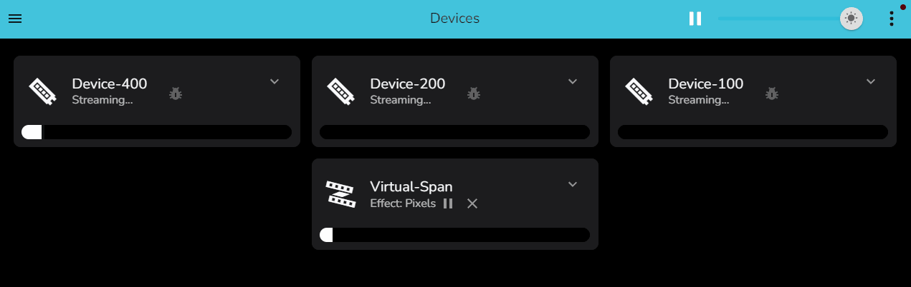
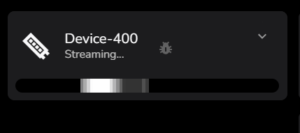

# How to: Create and Edit Virtuals

This page is intended to give guidance on how to use virtuals.

## TLDR;

### Span Virtual

One effect on the virtual spread across multiple segments on multiple
devices, note in this example there are significant difference in pixel
counts between devices. Effects are copied ratio\'d to the segments
pixel counts.

<picture>
   <source srcset="../_static/howto/virtuals/span1.gif" type="image/webp">
   
</picture>
  
<picture>
   <source srcset="../_static/howto/virtuals/span2.gif" type="image/webp">
   
</picture>
  

### Copy Virtual

One effect on the vitual copied to multiple segments on multiple devices
irrespective of pixel count

<picture>
   <source srcset="../_static/howto/virtuals/copy1.gif" type="image/webp">
   
</picture>
  
<picture>
   <source srcset="../_static/howto/virtuals/copy2.gif" type="image/webp">
   
</picture>
  

## So you want to know more?

Virtuals are a way to create a \"virtual\" device that can be assigned
its own active effects. The virtual is then mapped into other devices.

With virtuals it is possible to

-   Have multiple physical devices running exectly the same effect,
    fully synchonised, irrespective of led count
-   Spread a single effect across multiple physical devices to slice
    that effect up into portions that are displayed on different devices
-   Use multiple strips or matrix blocks to make one large matrix, as
    long as they are vertically stacked

## Devices vs Virtuals

Under the covers, in the dark depths of the LedFx code, there is a
single virtual created for each device, automagically. it is these
virtuals that the user interacts with via the UI, when assigning
effects.

So mapping new virtuals to devices, is really mapping new virtuals to
other virtuals, its virtuals all the way down.

## Segments

When building virtuals, they are made up of **segments** of devices, you
can select any range of pixels in any order. They don\'t have to be
complete devices, and the can be easily reversed.

## Creating a virtual

To add a new virtual, click on the large **+ icon** at the bottom of the
user interface and select **Add Virtual**

This will open the **Add Virtual Device** dialog

Thats a lot of options!!! Don\'t worry, we can ignore most of them, but
lets go over them all anyway first.

1.  **Name** - Give the virtual a name, this is what you will see in the
    UI, make it meaningful, once you have a hand full of physical
    devices, and your own virtuals on top, you want to be able to find
    what you are looking for.
2.  **Grouping** - This is a way to group pixels in a virtual or device
    into 1 pixel from the effect perspective, imagine you had a device
    with 10 LEDs but you want them to be treated as 1 pixel, you would
    set the grouping to 10. Generally leave this to default 1
3.  **Mapping** - Important! This is where you select how the effect
    will be mapped into the segments that make up the virtual
    -   **span** - A single instance of the active effect will be spread
        across all the segments that make up the virtual
    -   **copy** - A copy of the active effect will be displayed on each
        segment that makes up the virtual
4.  **icon name** - This is the icon that will be displayed in the UI,
    select something that makes sense to you. It is a string entry
    field, the mdi: or mui: prefix should be followed by the icon reference in kebab-case. Supported icons and their string mappings can be found at
    -   [mdi: Material Design Icons](https://pictogrammers.com/library/mdi/)
    -   [mui: Material UI Icons](https://mui.com/material-ui/material-icons/)
5.  **Max Brightness** - This is the maximum brightness that the virtual
    will display at, from 0 to 1. Generally leave at 1
6.  **Center Offset** - Pixel count by which to offset the center of the
    virtual when applying effects. Generally leave at 0
7.  **Preview Only** - Preview the effect without updating the real
    devices. Generally leave off.
8.  **Transition Time** - Length of transition when switching between
    effects.
9.  **Transition Mode** - How to blend between old and new effects
    during transition. Modes are Add, Dissolve, Push, Slide, Iris,
    Through White, Through Black, None. Default is Add.
10. **Frequency Min** - Use to limit the low end of the frequency range
    for audio effects on this virtual.
11. **Frequency Max** - Use to limit the high end of the frequency range
    for audio effects on this virtual.
12. **Rows** - Number of rows in the virtual. For a 1d strip this is 1.
    For a 2d Matrix, set as desired. For example a 512 pixel 16 columns
    by 8 rows, would need this value set to 8.

Once all of these have been configured, the next step is to add and
setup the segments that make up the virtual. So press the button handily
marked as **Add and Setup Segments**

## Adding a First Segment

We are ready to add our first segment, press the **Add Segment** button

Hit the drop down and a list of all devices will appear, select the
device from which you want to assign your first segment

Our first added device happens to have 400 pixels, and we can see all
are selected by default.

The currently selected segment under edit is animated live with a white
wash pattern, with a dark bar showing the direction of effect mapping.
This is displayed on the physical device, so you can directly see where
you are building your virtual layout in the real world.

<picture>
   <source srcset="../_static/howto/virtuals/virtuals6.gif" type="image/webp">
   
</picture>
  

## Adjusting the Segment

If we now set the start and end values by dragging the blue blobs, we
can change the range for this segment

The live physical device will also update the white wash pattern to
indicate the change as it is adjusted.

<picture>
   <source srcset="../_static/howto/virtuals/virtuals8.gif" type="image/webp">
   
</picture>
  

## Adding a Second Segment

Now lets get tricky and add a second segment, on the same device. Using
the sliders and watching the live wash, we will match them to fill the
device. Note the active segment under edit is rendered in white, other
segments in the virtual are cycled between red, green and blue, again
with the wash implying the direction of render.

You SHOULD NOT save if your segments overlap, the UI will warn you if
you try, however, if you leave the browser while in an overlapping
configuration, you can generate a bad virtual config, which you will
have to re-edit. Overlapping segments lead to undefined behaviour!

Note how the last edited segment is now white, and the other segment is
one of red, green, blue, cycling to show direction

<picture>
   <source srcset="../_static/howto/virtuals/virtuals10.gif" type="image/webp">
   
</picture>
  

Let\'s hit the flip button on one of those segments to show the changing
of the render direction

You can see the Flip button is now active and the impact on the live
wash pattern

<picture>
   <source srcset="../_static/howto/virtuals/virtuals12.gif" type="image/webp">
   
</picture>
  

## Adding a Few More Segments

Let\'s add a few more segments on the other devices

Note again in the live wash pattern, the last edited segment is white.

<picture>
   <source srcset="../_static/howto/virtuals/virtuals14.gif" type="image/webp">
   
</picture>
  

Now we are done, hit the back button. It is here that the UI would warn
you if you had overlapping segments, so if you see a warning, go back
and adjust the segments.

Using the pixels effect on the new virtual, we can see the effect spread
across all the segments we have just created

<picture>
   <source srcset="../_static/howto/virtuals/virtuals15.gif" type="image/webp">
   
</picture>
  

Now you can add any effect to the virtual, and it will be spread across
all the segments you have created. Or in this case we changed the
virtual from a span to a copy, so the effect is copied to each segment,
while observing the flip switch for directionality.

<picture>
   <source srcset="../_static/howto/virtuals/virtuals16.gif" type="image/webp">
   
</picture>
  

## \...Profit

Segments can be changed in order, by using the up and down arrows, and
deleted by using the trash can icon.

Segments are a very powerful tool to create complex virtuals to control
your physical devices from a single effect dialog.

Remember that segments can also be used to stack matrix together in one
dimension.

To build a larger matrix from smaller matrix blocks, ensure you stack
them rather than tile.

For a 64x64 end matrix made up of 4 devices, you should configure into 4
devices of 16x64, not 4 of 32x32.

As we can only stack in one dimension, putting the 4 devices of 16x64
together via virtuals will allow you to achieve a 64x64 matrix
controlled by a single virutal in ledfx.
