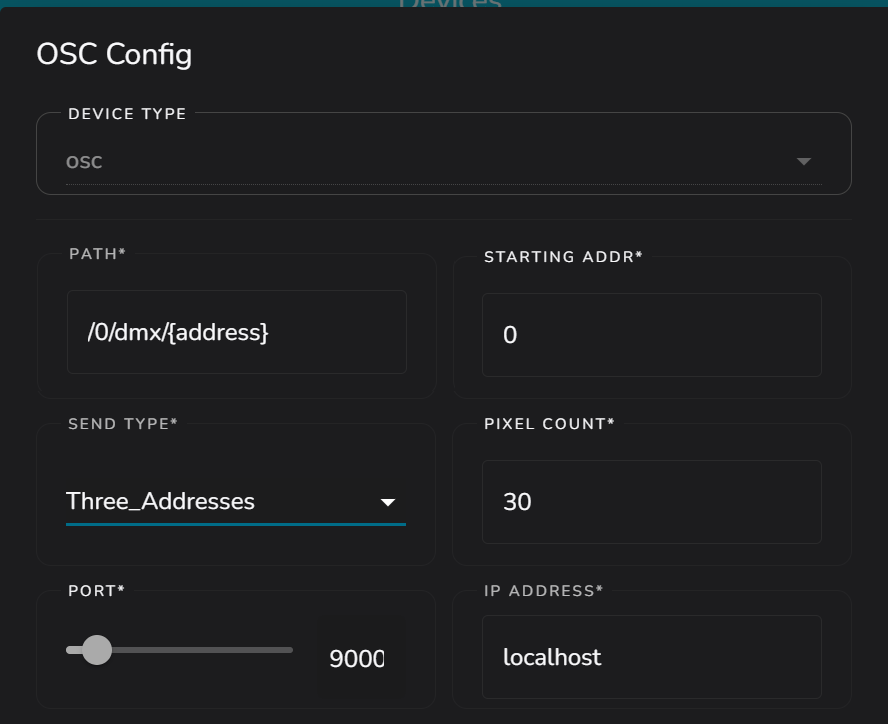

===================
    OSC Device
===================

Why does this exist
-------------------

The OSC Device exists because OSC is a commonly used protocol in the lighting technics.
The OSC Device is a device which sends commands to an OSC Server with the DMX paths (`/<universe>/dmx/<addr>`)

How to use/setup
----------------

To use the OSC Device, you firstly need to have
an OSC Server running somewhere accessible over internet.
If you don't have one, then you don't really
have to read this. If you wish to make an OSC Server
you could make use of the `DmxOscServer pip package <https://pypi.org/project/DmxOscServer>`_
to make your own server, which you can use to control
other stuff really easy (like GPIO based led panels)

To set it up, go to the Devices tab at LedFx.
Click the Add button and then click Add a device.
Make sure to select 'OSC' as type of the device.

Now you will have to set the universe and the
starting address of your device on your OSC Server.

Now at the 'Send Type' setting you choose between:

    * One Argument
        - Will send an array to the specified address.
        - Path: `/<universe>/dmx/<addr> [R, G, B]`
        - Pro's:
            - Works good
        - Cons:
            - Not all servers support it

    * Three Arguments
        - Will send 3 arguments to the specified address.
        - Path: `/<universe>/dmx/<addr> R G B`
        - Pro's:
            - Works everywhere
        - Cons:
            - None

    * Three Addresses (least recommended, since it has to send a lot which creates a lot of lag)
        - Will send the RGB data on 3 seperate addresses starting from the specified address.
        - Paths: `/<universe>/dmx/<addr> R`, `/<universe>/dmx/<addr+1> G`, `/<universe>/dmx/<addr+2> B`
        - Pro's:
            - Works with QLC+ with the 'Generic RGB' fixture
        - Cons:
            - Sends a lot of data
            - Can slow down the result (will result into 'latency' at your receiving server)

Then you have to set the 'Pixel Count' option.
You should see this as 'Address/Channel Count',
since it represents the amount of addresses
your server is listening on using the selected send type.
This means that if you choose 'Three Addresses'
as send type, then if you have 9 addresses listening
in the order like `R,G,B,R,G,B,R,G,B`, then you
should set this setting to **3** since you are
having 3 'pixels' on which your server is listening

Then you can set the Port and IP Address to which
your OSC Server is listening.
Then you can click Save.

Here is an configuration for a fixture at universe 0
with starting address also at 0 and having 90 addresses
where it is like R, G, B, R, G, B, etc. which makes the
send type to be '3 addresses' and the pixel count to 30.
The server whichs handles the fixture is listening at
`localhost:9000`:

What it does
------------

The OSC Device does the same as all the others,
except the OSC Device sends the RGB data to a
server matching the (DMX mapped) OSC Protocol.
Meaning it will work for OSC Servers which paths
are mapped like `/<universe>/dmx/<addr>`.

