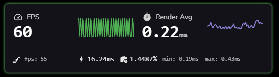
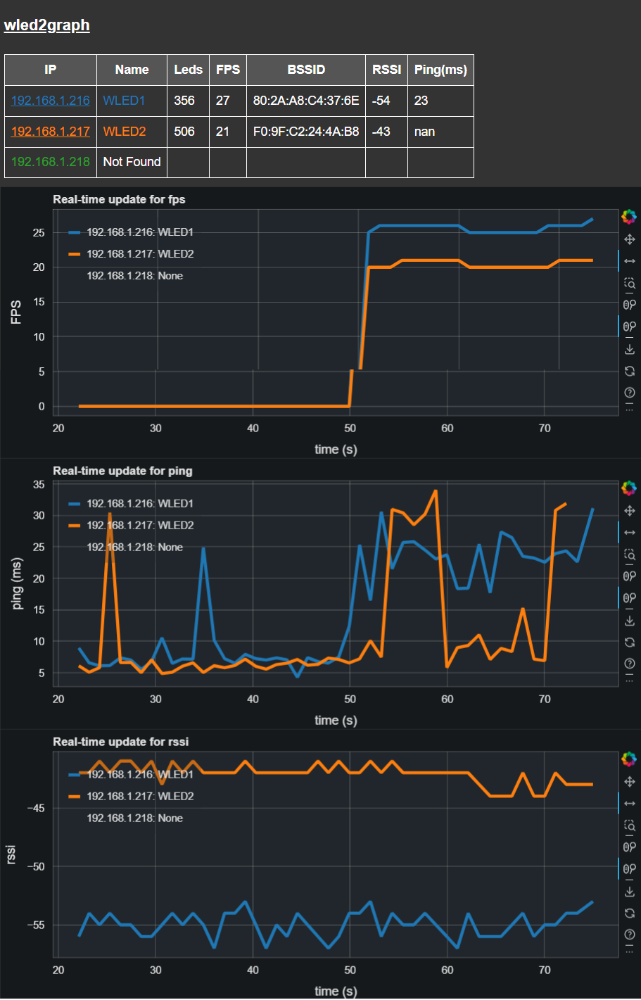

# Network & Performance Troubleshooting

The host system and networking infrastructure in which LedFx and the client devices live, is a big space and there are MANY things that can wrong, impacting your experience.

These normally start with wailing, gnashing of teeth and cries of "why does LedFx lag...".

We strive to ensure that LedFx runs smoothly where possible.

We are currently not aware of lag scenarios induced by LedFx itself ( yes, the more we say that, the more likely it is we have a deep dark dirty secret somewhere ).

Major efforts over time have removed sources of glitching, and we generally run heavy weight system regressions that will identify emergent issues during development and release.

## Common sources of lag

LedFx can't tell you how to fix your system, but there are places your problem is likely to be hiding, and we can comment from general experience.

### Underpowered host

Yes you can run LedFx on that dusty old Pi3 you had in a drawer, but LedFx cannot help with the underlying performance of the OS on the hardware. Yes, LedFx core is mostly written in python, but that is part of its charm for us developers, and anywhere we do heavy lifting of data and math, we strive to implement in numpy or other optimised libraries.

If you are running a reasonable system, and not trying to push around 100K pixels, noting we regularly test with 20K+, then your host should be able to cope. Look at processor loading, ensure there is headroom in there. If you are running multiple services on a constrained system, then LedFx can only use the time it is given. Do you have services spinning up aggressively at inopportune times, such as deep virus check across all your storage, for example.

## Tools to investigate

### Diagnostic Effects

Some simple, deterministic effects are built into LedFx, to allow investigation of pixel progression and synchronous time aligned behaviors, without audio impacts.

Note that improvements in front end rendering via GPU acceleration have greatly improved the visualisation of the effects, to meet realtime against the core. LedFx had always been written to service the physical devices as the priority, but this GPU advancement has removed many sources of delay to the browser front end, and if run on a local browser instance should be very tight to actuals.

#### Metro Effect

Metro runs a sequence that by default will display half black and half white for 300 milliseconds every 1 second.

The pattern progresses further dividing by 2, the black and white division.

The default 4 step behavior on a 1d strip is


The behavior with steps, the number of such divisions to make before looping, set to 6 on a 2d matrix is


By watching the browser visualisation, hosted on the same machine as LedFx, to avoid any network implications, and comparing that to the behavior on the physical device LEDs, it should be easy to identify if there is distinct Lag or pattern mismatch. Do they both switch at exactly the same time, or are they different, are they consistently different, or does it vary. Which is seemingly early compared to the other.

If there is a mismatch, then it implies that there is artifacting between the LedFx / browser visualisation running on the host and the endpoint itself. That artifacting could be due to network impacts, or even crashes and lags on the endpoint device.

Metro is good for looking at tight tracking between the LedFx core and the device as it should be reasonably possible to see the very simple pattern correlation and the dynamic hard changes from off to white on both at the same time.

If you have to use a remote browser instance to look at the visualisation, this introduces the risk of network delay impacting the visualisation as well, but can still be used to assess to some degree.

#### Pixels Effect

Pixel runs by default, a single pixel from index 0 to the end of the strip or matrix in 1 second increments.

For a simple 16 pixel strip at default it looks like the following


This diagnostic effect can be used for various needs

- Ensure that the pixel mapping is well ordered to expectation.
- Ensure that the periodic step progression is smooth and without jitter
  - For visualisation front end
  - For physical device
- General comparison between front end visualisation and physical device

To investigate periodic step smoothness, looking for lag and jitter, it is better to turn the step period down to 0.1 seconds. This may also be needed for longer strips and matrix when looking at ordering issues.

If the visualisation on the browser is smooth, but the device is lagging / jittery then the issue is in the network or device.

If the visualisation on the browser is NOT smooth then the host is glitching / underpowered or are you sure you are on a local browser!?!


Using the BUILD UP switch will cumulatively fill the strip


For extreme cases such as large pixel matrix, turn up the *pixels count* to step in blocks.


### LedFx Effect and Device Performance Stats

Basic performance statistics of the LedFX effects and in some cases such as WLED from the physical device itself can be monitored from within the LedFx effect configuration dialogs. Choose your desired device or virtual in LedFx and set the *Advanced* switch to on. You should now have an extra switch ( along with others ) for *Diag*, switch that to on as well.

In the virtual configuration screen you will now get the following dialog appear ( subject to change as we improve the implementation )



The large FPS number is the rate that LedFx has maintained in effect generation over the last second.
The small FPS that may appear below it is the reported FPS from the endpoint if supported. Currently only by WLED.

Render Avg is the average time to render a frame over the last second. Below that are min and max times in case any glitching is going on.

The little power symbol shows how many milliseconds are available in a frame followed by a percentage of that time that is on average being consumed for this effect.

It should be noted that the effect Noise is by a 10x magnitude the greediest of any existing effect in LedFx due to the heavy math implied, so if you want to stress your system, its the place to go!

### wled2graph

This is an external tool for monitoring the FPS, wifi and ping performance of multiple WLED devices over time. It allows graphs to be built up over a period of time to look for intermittent or chronic performance issues.

[pypi wled2graph](https://pypi.org/project/wled2graph/)

[github wled2graph](https://github.com/bigredfrog/wled2graph)



## Networking Improvements

## General Network Health

LedFx and the devices to which it commonly communicate are *extremely* latency sensitive and will expose weaknesses in your WiFi network.

Most protocols such as DDP, E1.31 sACN, Art-Net, for driving LED devices are themselves based on top of UDP. Network performance issues will lead to delay or loss of packets, and a poor experience on the real time performance of the physical LED devices.

LedFx defaults to DDP for WLED as through experience, it appears to be the most stable of implementations, with a reasonable efficiency compared to the alternatives.

To minimize the risk of performance issues, we recommend:

1.  **Disable WiFi Sleep Mode on WLED**
  - If you are not battery powered, there is little reason to use this.
2.  **Minimize WiFi activity on your network**
  - From all sources
  - Use ethernet where reasonable.
3.  **Use Ethernet**
  - If you are a commercial operation and performance REALLY matters. Your environment is likely full of legacy WiFi networks and customer phones.
4.  **Ensure your Access Point (AP) is appropriate**
  - For the number of devices and amount of traffic.
  - Enterprise class APs are intended to support MANY more client devices that your average consumer grade.
5.  **Position your WiFi AP**
  - High up and clear of obstruction.
6.  **Use an appropriate WiFi channel**
  - [only consider 1, 6, 11](https://www.metageek.com/training/resources/why-channels-1-6-11/) clear of interference from other networks.
  - Read [Metageek Understanding WiFI Signal Strength](https://www.metageek.com/training/resources/wifi-signal-strength-basics/)
7.  **Stick to 20 MHz channels**
  - While WLED devices continue to only support 2.4GHz Wifi
  - DO NOT configure 40 MHz channels, keep everything at 20 MHz wide.
8.  **Check the RSSI level** received by the WLED device
  - Read [Metageek Understanding RSSI](https://www.metageek.com/training/resources/understanding-rssi/).
  - If you are -70 or worse, you are going to have a bad time.
9. **Use a site survey tool** to really understand what is happening in your 2.4 GHz environment, such as
  - Metageek InSSIDer free tier
  - Various free phone apps, be careful to use a reputable one!

10. **Educate yourself on Wifi fundamentals**
  - [Metageek tutorials](https://www.metageek.com/training/) are highly recommended.

### DNS name resolution

If you are having difficulty with DNS name resolution and your devices are configured as mydevice.local for the ip address try giving them fixed IP addresses in your router and using those IP addresses in LedFx

### mDNS WLED crash issues

There are community reports of excessive mDNS traffic in the host network leading to intermittent WLED crashes as its mDNS support gets overloaded.

See [Quinled article on WLED crashes and reboots every xx minutes](https://quinled.info/wled-crashes-and-reboots-every-xx-minutes-mdns/)

Please note: Quinled have kindly captured this information, the problem is not related directly to Quinled products, rather a generic weakness in WLED exposed by abuse of mDNS traffic from other sources.

These may be attributed to HA and Matter implementation, but may also be due to other sources.

Try turning off mDNS support in WLED as recommended in the Quinled article.

### Access via LAN

All current builds should be by default accessible from LAN - please ensure that you allow traffic from port 8888 from the host machine according to the firewall configuration of your OS or router.

Your LedFx front end should be available on

```
http://your_host_machine_ip_or_name:8888
```

from PC or phone browser anywhere within your network.

## I only get something less than 480 LEDs in WLED

With a long led strip, of greater than 480 pixels, LedFx only seems to drive 480 or less.

### Maybe it's the network interface MTU

If the MTU of the networking interface on your host PC is not set to the common default 1500 bytes, fragmentation of the UDP packets that DDP is transported on, may cause issue with WLED at consumption of the DDP protocol

By default, LedFx splits up separate DDP packets at 480 pixel boundaries. So for example in a 1024 pixels device, it will take 3 DDP over UDP packets to transmit a single frame of data. Each packet will have a max UDP size of 1492 bytes made up of headers plus 3 x 480 bytes for RGB data

If the MTU of the network interface is less that 1500, the UDP packets will get fragmented, and its possible that WLED will only service the first fragment and ignore the remaining fragment and all following DDP packets until the next frame cycle.

If any interface has less that 1500 it is recommended to fix it to 1500. Use Chatgpt or other sources to resolve exact steps for your system.

### Checking your MTU
#### On Windows

Open Powershell and run

``` console
Get-NetIPInterface | Select-Object InterfaceAlias, AddressFamily, NlMtu
```

#### On Linux

```console
ip link show
```

#### On macOS

```console
ifconfig | grep mtu
```

## Need more help?

Reach out to the LedFx team through Discord. Preferably copy and paste
with your answers below

> -   New build/recent upgrades?
> -   python version?
> -   LedFx version you are using?
> -   restarted your PC and issue continues?
> -   any changes/deleted your LedFx config file?
> -   Problem:
